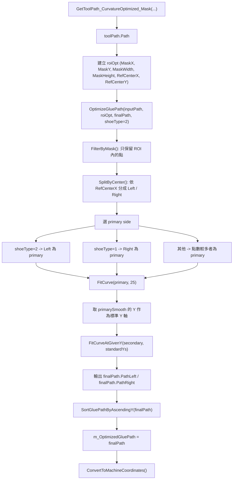

# OptimizeGluePath 分析

## 1. 主要呼叫點

在 [WorkTab.cpp](/D:/Git%20Repository/chengyi-chung/SP-AX3/WorkTab.cpp) 中，流程核心是：

```cpp
OptimizeGluePath(this->toolPath.Path, roiOpt, finalPath, 2);
SortGluePathByAscendingY(finalPath);
this->m_OptimizedGluePath = finalPath;
ConvertToMachineCoordinates();
```

這代表 `OptimizeGluePath(...)` 不是單獨功能，而是整個膠路徑處理流程中的中段：

1. 前段先由 `GetToolPath_CurvatureOptimized_Mask(...)` 產生 `toolPath.Path`
2. 中段由 `OptimizeGluePath(...)` 將路徑整理成左右兩條標準化膠路徑
3. 後段再做 Y 排序、存入 `m_OptimizedGluePath`、轉成機台座標

## 2. 流程圖



## 3. 函式關係

### 3.1 `OptimizeGluePath(...)`

位置：
- [UAX.cpp](/D:/Git%20Repository/chengyi-chung/SP-AX3/UAX/UAX.cpp)

這是一個包裝函式，主要工作是：

1. 檢查 `inputPath` 是否為空
2. 建立 `GluePathOptimizer optimizer(roi)`
3. 呼叫 `optimizer.OptimizePath(inputPath, optimizedPath, shoeType)`
4. 在 debug 模式輸出左右路徑點數

也就是說，真正演算法主體在 `GluePathOptimizer` 類別裡。

### 3.2 `GluePathOptimizer`

位置：
- [GluePathOptimizer.h](/D:/Git%20Repository/chengyi-chung/SP-AX3/UAX/GluePathOptimizer.h)
- [GluePathOptimizer.cpp](/D:/Git%20Repository/chengyi-chung/SP-AX3/UAX/GluePathOptimizer.cpp)

`GluePathOptimizer` 主要把一串原始 path 點，整理成：

- `GluePath.PathLeft`
- `GluePath.PathRight`

並讓兩邊路徑在 Y 方向上對齊。

## 4. 演算法步驟說明

### 4.1 `FilterByMask(...)`

功能：
- 只保留落在 ROI 矩形範圍內的點

輸入：
- `inputPath`
- `ROIMask.MaskX / MaskY / MaskWidth / MaskHeight`

輸出：
- `maskedPath`

目的：
- 排除 ROI 外的雜點，避免後面左右分群時被干擾

### 4.2 `SplitByCenter(...)`

功能：
- 依 `ROIMask.RefCenterX` 將點分成左右兩群

規則：
- `pt.x >= RefCenterX` -> `rightPts`
- `pt.x < RefCenterX` -> `leftPts`

目的：
- 用 ROI 中心線當左右腳膠路徑的分界

### 4.3 決定 primary side

在 `OptimizePath(...)` 中，會先決定哪一側是主參考路徑：

- `shoeType == 2`：`Left` 當 primary
- `shoeType == 1`：`Right` 當 primary
- 其他：左右哪邊點數多就用哪邊

你目前的呼叫是：

```cpp
OptimizeGluePath(this->toolPath.Path, roiOpt, finalPath, 2);
```

所以目前固定是：

- `shoeType = 2`
- `PathLeft` 為主路徑

### 4.4 `FitCurve(...)`

功能：
- 對 primary side 做平滑與重新取樣

流程：

1. 計算 arc-length parameter
2. 以弧長 `s` 作為自變數
3. 分別對 `x(s)`、`y(s)` 做四次多項式擬合
4. 重新取樣成固定數量點，預設 `25` 點

相關函式：
- `ComputeArcLengthParam(...)`
- `PolyFit(...)`
- `PolyEval(...)`

目的：
- 把原始不均勻、帶雜訊的 path 平滑成穩定主曲線

### 4.5 `FitCurveAtGivenY(...)`

功能：
- 讓 secondary side 依照 primary side 的 Y 位置做對齊

流程：

1. 將 secondary 點依 Y 排序
2. 若有重複 Y，先平均同 Y 的 X
3. 對 primary 的每個 `targetY`
   - 若超出範圍，取端點 X
   - 若在範圍內，做線性插值
4. 輸出 `(x, targetY)` 形式的點集

目的：
- 讓左右兩條路徑在相同 Y 座標上成對存在
- 方便後續膠路徑控制、排序與機台座標轉換

### 4.6 輸出 `GluePath`

若 `Left` 是 primary：

- `optimizedPath.PathLeft = primarySmooth`
- `optimizedPath.PathRight = secondarySmooth`

若 `Right` 是 primary，則相反。

## 5. 前段來源：`toolPath.Path` 怎麼來

`OptimizeGluePath(...)` 的輸入 `this->toolPath.Path` 並不是原始影像，而是前段函式先從影像中取出的中心路徑：

- [UAX.cpp](/D:/Git%20Repository/chengyi-chung/SP-AX3/UAX/UAX.cpp) 的 `GetToolPath_CurvatureOptimized_Mask(...)`

它大致會做：

1. 灰階化
2. BinaryLower / BinaryUpper 做二值化範圍過濾
3. `findContours(...)`
4. 取主要 contour
5. 產生中心路徑 / 採樣點
6. 輸出到 `ToolPath.Path`

所以整體來看：

- `GetToolPath_CurvatureOptimized_Mask(...)` 偏影像與輪廓抽取
- `OptimizeGluePath(...)` 偏幾何整理與左右路徑標準化

## 6. 後段處理

### 6.1 `SortGluePathByAscendingY(finalPath)`

功能：
- 把 `PathLeft`、`PathRight` 再依 Y 由小到大排序

目的：
- 確保後面輸出、畫圖、轉座標時，路徑順序一致

### 6.2 `ConvertToMachineCoordinates()`

功能：
- 將最佳化後的影像座標路徑轉換成機台使用的座標系統

目的：
- 把影像運算結果真正接到設備運動控制資料

## 7. 這段功能的角色定位

`OptimizeGluePath(...)` 的角色不是「找輪廓」，而是：

- 將已經抽出的中心 path
- 限制在指定 ROI
- 依中心線拆左右
- 選一邊當主曲線
- 將另一邊對齊主曲線的 Y 座標
- 產生可用於雙邊塗膠的標準化結果

## 8. 重要觀察

### 8.1 `shoeType = 2` 的影響很大

你目前固定傳 `2`，代表：

- 一律以左側為 primary

如果現場實際影像左右分布與這個假設不一致，可能造成：

- 主路徑選錯
- 另一側插值失真
- 最後 `finalPath` 品質變差

### 8.2 `RefCenterX` 是左右拆分的核心

`SplitByCenter(...)` 完全仰賴 `RefCenterX`。

若 ROI 或 reference center 設定不準，會直接導致：

- 左右點分錯邊
- 某一側點數過少
- primary / secondary 路徑品質下降

### 8.3 `FitCurve(...)` 是固定 25 點

目前主曲線會被重新取樣成固定點數 `25`。

這代表：

- 優點是輸出格式穩定
- 缺點是過短或過複雜曲線可能被過度平滑

## 9. 一句話總結

`OptimizeGluePath(this->toolPath.Path, roiOpt, finalPath, 2);` 的本質，是把前段影像萃取出的單一路徑點雲，依 ROI 與中心線拆成左右兩條可對應的標準化膠路徑，供後續排序、顯示與機台座標轉換使用。
